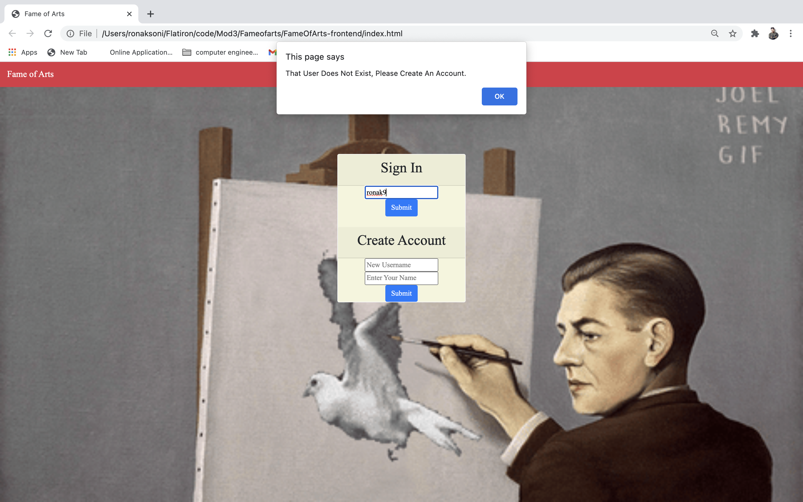
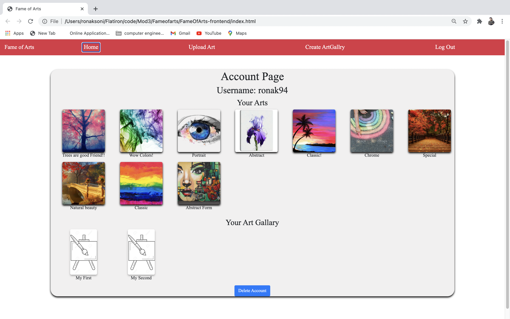
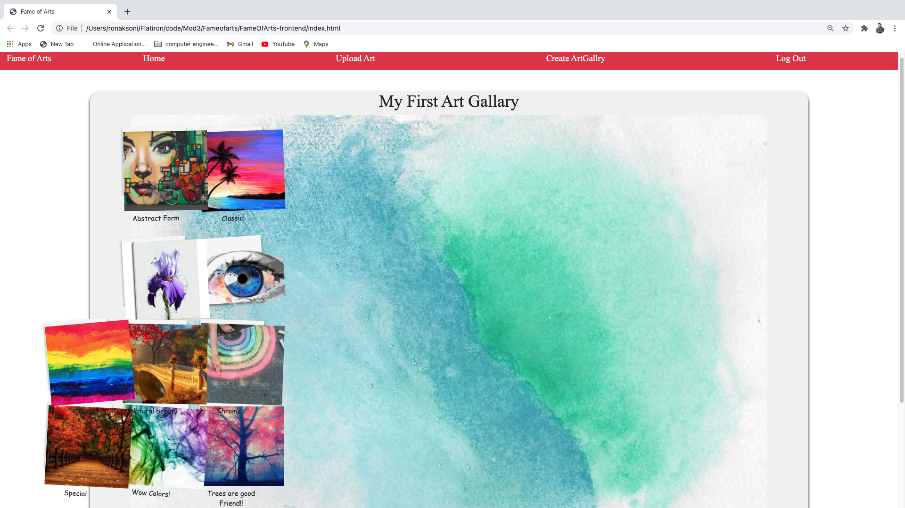
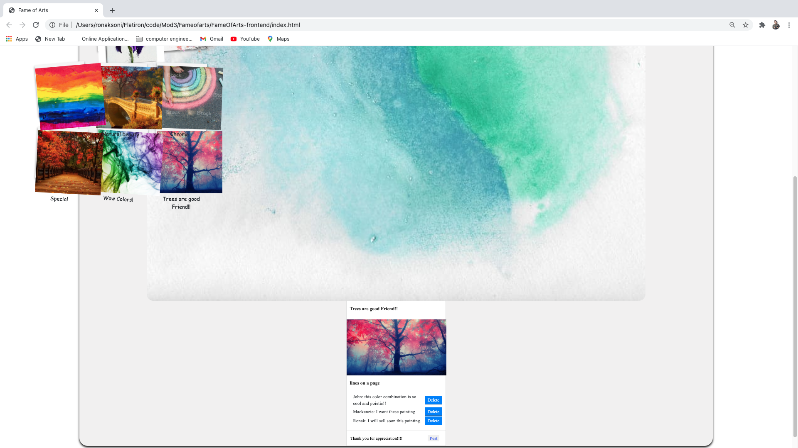
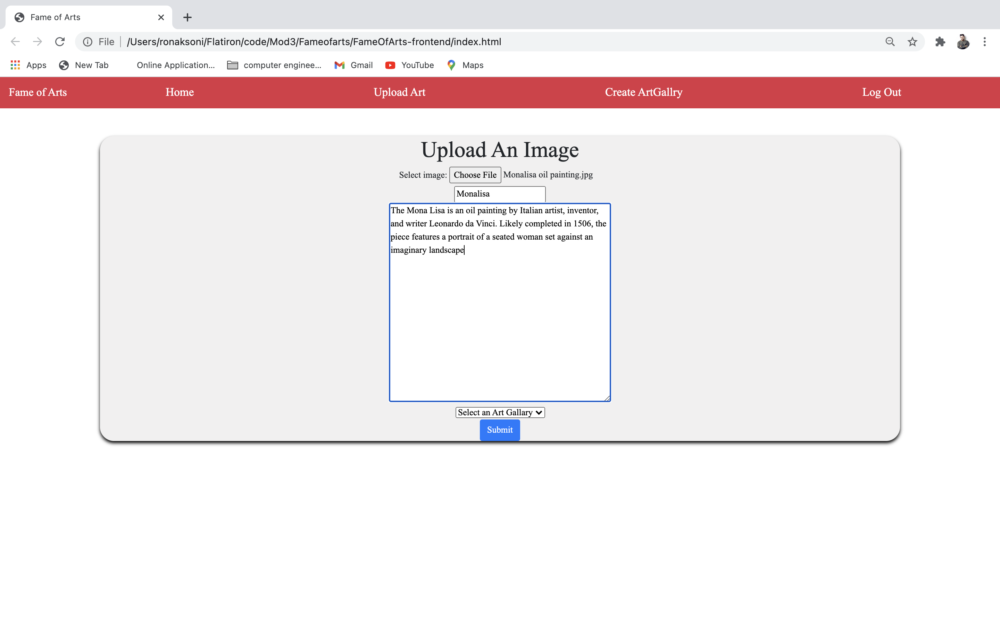
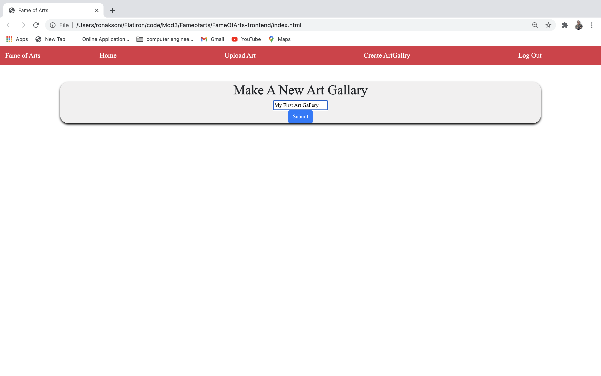

# FameOfArts - Frontend

FameOfArts is an app for Artist allowing to upload and manage their paintings by creating multiple Art galleries. It's a Virtual Art gallery so viewers can see each Art gallery's paintings created by Artist. Moreover, they interact, chat with each other via comments.  

## [This is a Demo Video](https://www.loom.com/share/8053fe06d67d4a21883acdce38148c0a) link of the Application
[This](https://github.com/ronakvsoni/FameOfArts-backend) is a link to the back-end repository.

## Motivation

I wanted to create an app that allows Creative art lover audience to connect in a wholesome way, especially if the art lovers are unable to connect in person during the pandemic, So, this is the way they can connect and interact and buy artist's paintings, sculpture whatever they publish virtually and they also can give their feedback.

## Screenshots
Login

Account Page

Viewing the Art gallery

Commenting on paintings

Upload an Art 

Create the ArtGallery

## Technology Used

- JS
- Rails Router

## Features

Users Can:
- Create an account
- Upload arts paintings
- Create art galleries 
- Post art painting images to art galleries
- Comment on art paintings

## Installation

clone the front-end, at the top of index.js change client-id value to your imgur client id, and run 'open index.html'

clone back-end repo, run the following commands in order: bundle install, rails db:migrate, rails db:seed, rails s.

## Contributing

Contributions are welcome, submit a pull request!

## Author

* **Ronak Soni** - [GitHub](https://github.com/ronakvsoni)

## License

This project is licensed under the [GNU GPL](https://www.gnu.org/licenses/gpl-3.0.en.html)